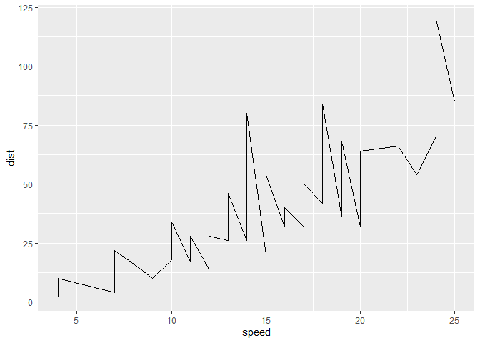

<!-- README.md is generated from README.Rmd. Please edit that file -->

# ggfail

<!-- badges: start -->

<!-- badges: end -->

It’s common to forget a “+” in a ggplot call, this is an attempt to fail
explicitly in those cases.

This is not very robust, might stop working if the code of ggplot2
changes, but since it’s a package to help debugging I guess it’s ok, you
won’t break anything.

## Installation

Install with :

``` r
remotes::install_github("moodymudskipper/ggfail")
```

## Example

Run `ggfail::trace_funs()` after attaching *{ggplot2}*, or copy the
following to your .Rpofile, it will run `ggfail::trace_funs()`
(silently) anytime you attach *{ggplot2}*:

``` r
setHook(packageEvent("ggplot2", "attach"),
        function(...) ggfail::trace_funs())
```

Then this will work as expected :

``` r
library(ggplot2)
plt <- function() {
  ggplot(cars, aes(speed, dist)) +
    geom_point()
}
plt()
```



But this will fail explicitly (because we miss a “+”)

``` r
plt <- function() {
  ggplot(cars, aes(speed, dist))
    geom_point()
}
plt()
#> Error in eval(expr, p) : Did you forget a `+` in a ggplot call ?
#> Use `print(geom_point())` to view the object, or set `options(ggfail = FALSE)`
#> to disable this error.
```

Note : because *{knitr}* does some call manipulation and we use
`sys.call()` in this package, this won’t work with markdown reports (so
I had to cheat right here) nor reprexes made with the *{reprex}*
package. I think it’s fixable, but unless you ask me I probably won’t
fix.

It works by making some ggplot functions fail if they’re not called by
`+`, or a selection of other allowed functions. all functions from
*{ggplot2}* prefixed in some ways (“geom\_”, “facet\_” etc), with
exceptions (“coord\_munch” etc) are traced.

you can untrace with `ggfail::untrace_funs()` but setting
`options(ggfail = FALSE)` will work just as well without untracing to
get back to original behavior.

``` r
options(ggfail = FALSE)
plt <- function() {
  ggplot(cars, aes(speed, dist))
    geom_point()
}
plt()
#> geom_point: na.rm = FALSE, orientation = NA
#> stat_identity: na.rm = FALSE
#> position_identity 
```

Note : at the top level this won’t fail, see it as a feature\!

``` r
options(ggfail = TRUE)
ggplot(cars, aes(speed, dist))
    geom_point()
```
